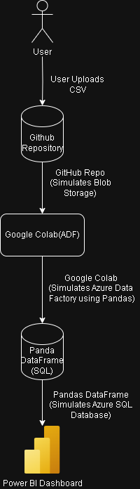

# Simulated Azure Cloud Pipeline for Supply Chain Project

This document describes how we simulated Azure data processing using free tools.

## 🎯 Purpose
To mimic a real Azure pipeline (ADF, Blob Storage, SQL) using Google Colab and Pandas.

---

## 🛠 Tools Used

| Azure Component       | Simulated With           |
|-----------------------|---------------------------|
| Azure Blob Storage    | GitHub + Local Files      |
| Azure Data Factory    | Pandas in Google Colab    |
| Azure SQL DB          | Pandas DataFrame          |
| Power BI              | (Handled by teammate)     |

---

## 🔁 Pipeline Flow (Simulated)

1. *Data Ingestion*  
   - Uploaded raw CSV using files.upload() in Colab.

2. *Data Cleaning*  
   - Removed null values.
   - Filtered for shipment_status = 'delivered'.
   - Converted date columns to datetime.
   - Sorted by order date.

3. *Data Storage*  
   - Exported cleaned data to CSV (cleaned_supply_data.csv).
   - Exported HTML table (supply_table.html) for frontend/dashboard use.

---

## 📤 Outputs

- cleaned_supply_data.csv: Final processed dataset.
- supply_table.html: Table ready for embedding into a web dashboard.
- simulate_pipeline.ipynb: The full notebook with all logic.

---
## Architecture Diagram

## Simulated Data Pipeline Flow
1. *User uploads CSV*  
   The raw dataset is uploaded into a GitHub repository. This simulates uploading files to Azure Blob Storage.

2. *Google Colab (acts like Azure Data Factory)*  
   Google Colab reads the CSV directly from the GitHub repository, simulating how ADF pulls data from Blob Storage.

3. *Data cleaning and transformation using Pandas*  
   Within Colab, we perform data cleaning and transformations using Pandas, acting as a transformation step in ADF.

4. *Pandas DataFrame (acts like Azure SQL Database)*  
   The final cleaned dataset is stored in a Pandas DataFrame, representing a staging or production table in an Azure SQL Database.

5. *Power BI Dashboard*  
   Power BI reads the processed dataset (CSV exported from Pandas) to build interactive visual dashboards, just like connecting to Azure Data Warehouse.

## Relevant Files in This Repository

- 📂 [/Notebooks/Cleaning.ipynb](../Notebooks/Cleaning.ipynb) - Google Colab notebook that reads from GitHub and cleans the data.
- 📂 [/Processed/processed_data.csv](../Processed/processed_data.csv) - Cleaned data exported from Pandas.
- 📂 [/PowerBI/SupplyChainDashboard.pbix](../PowerBI/SupplyChainDashboard.pbix) - Power BI dashboard built on the processed dataset.
