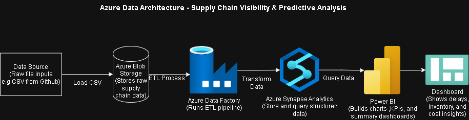
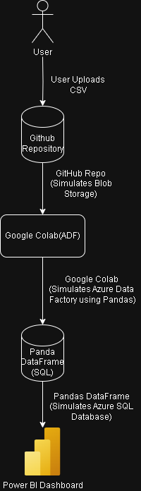

<h1 align="center">🌐 Supply Chain Visibility & Predictive Analysis</h1>
<h3 align="center">🔹 Free-Tools Simulation → Azure Cloud Migration Ready 🔹</h3>

<p align="center">
  
  
  
  
</p>

---

## 🚀 **Project Overview**

This project showcases a **real-world supply chain analytics system** built entirely with **free tools** (Google Colab + Power BI + GitHub) while **simulating Azure Cloud architecture**.  
It provides complete **visibility**, **predictive insights**, and **performance analytics** — all ready for direct migration to Azure services.

🎯 **Goal:** Demonstrate how powerful cloud-inspired architectures can be built cost-free — ideal for students, analysts, and cloud architects.

---

## 🧩 **Why This Project Matters**
> _“In supply chains, visibility is power.”_

Enterprises often lack integrated data and forecasting capabilities.  
This project bridges that gap by:

✅ Creating a **single source of truth** for orders, shipments, and suppliers  
✅ Predicting **shipment delays** and **demand fluctuations**  
✅ Providing **real-time dashboards** for smarter decision making  
✅ Using **Azure-equivalent architecture** with 100% free tools  

---

## 🏗️ **Tech Stack & Architecture**

| Layer | Free Tools (Simulation) | Azure Equivalent |
|-------|--------------------------|------------------|
| **Data Storage** | GitHub CSVs | Blob Storage |
| **ETL & Processing** | Google Colab (Pandas, NumPy) | Data Factory + Synapse |
| **ML Models** | Scikit-Learn | Azure ML / Synapse ML |
| **Visualization** | Power BI Desktop | Power BI Service |

---

🗂️ **Folder Structure**

📦 Supply-chain-visibility
┣ 📁 Architecture # Azure-like architecture diagrams
┣ 📁 Data # Raw & cleaned datasets
┣ 📁 Documentation # Project documentation and presentation guide
┣ 📁 ML # Forecasting and delay prediction outputs
┣ 📁 Notebook # Google Colab notebooks for EDA & ML
┣ 📁 pipeline # Simulated ETL pipeline steps
┣ 📁 PowerBi # Power BI report (.pbix) and screenshots
┗ 📄 README.md

---

## 🧩 Architecture Diagram



*Figure: Azure Data Architecture for Supply Chain Visibility*

This diagram illustrates how raw supply chain data (e.g., from CSV files) flows through Azure services — starting from Blob Storage, processed by Data Factory, transformed in Synapse Analytics, and visualized in Power BI. The final dashboard offers insights into delays, inventory, and costs for improved decision-making.
> The architecture includes:
> - Azure Blob Storage for raw data upload  
> - Google Colab for ETL and predictive modeling  
> - Power BI for data visualization  
> - GitHub for version control and collaboration

---

## Free tools → Azure mapping
| Capability            | Free-tools now                          | Azure later (planned)              |
|---|---|---|
| Object storage        | GitHub repo (small CSVs)               | Blob Storage containers            |
| Orchestration         | Colab notebook steps + README          | Azure Data Factory pipelines       |
| Transform/warehouse   | Pandas in Colab                        | Synapse Serverless/Dedicated SQL   |
| ML training/inference | Scikit-learn in Colab                  | Azure ML / Synapse ML              |
| BI                    | Power BI Desktop                       | Power BI Service (workspaces)      |

---

## 🧠 Key Features

- ✅ Simulated Azure architecture using free tools
- 🧪 Data pipeline with Colab-based ETL & machine learning
- 📈 Interactive Power BI dashboard with slicers, icons, and forecast tooltips
- 🔮 Predictive models: demand classification & delay forecasting
- 📦 Shipment tracking by status, region, and supplier performance
- 🔔 Risk alerts and forecast overlays inspired by enterprise BI dashboards
---

## 🎯 Project Goals
- Enhance transparency across the supply chain
- Predict delivery risks and delays before they happen
- Visualize performance metrics through interactive dashboards
- Use mostly free / accessible tools (Google Colab, Power BI, Azure Free Tier)

---

## 🏗 Architecture Overview


*Pipeline:*
- *Azure Blob Storage:* Stores raw and cleaned datasets.
- *Python ETL:* Simulated in Google Colab notebooks (cleaning, feature engineering).
- *Azure Synapse (simulated):* For advanced analytics and warehousing.
- *Power BI:* Builds live dashboards with predictive insights.

---

## 📊 Highlights from EDA
- *Delivery Status:* Many orders delayed — investigate shipping, product, region causes.
- *Order Types:* Payments & Expenses dominate; digital-first flow.
- *Shipping Methods:* Mostly Standard Class — opportunity to optimize for speed vs cost.
- *Customer Segments:* Balanced Consumer & Corporate, small Home Office niche.
- *Correlations:* Delays linked with risk and discounts — ideal for predictive models.
- *Seasonality:* Monthly fluctuations show demand cycles.

---

## ⚙ Features
- Upload & store datasets in Azure Blob
- Simulate ETL pipeline in Python notebooks
- Run predictive analyses (risk, delays)
- Build interactive dashboards in Power BI
- Collaborate via GitHub with a modular structure

---

## 🧩 Azure-Inspired Architecture


> Simulated components include:
> - **GitHub** as Azure Blob Storage (for versioned CSVs)
> - **Google Colab** as Azure Data Factory + ML Studio
> - **Power BI** to replicate the Power BI Service
> - **Scikit-learn models** for forecasting & delay prediction

---

## 🏗 Deployment Pipeline Overview


- **Data Ingestion**: CSVs uploaded to GitHub
- **Preprocessing & ML**: Performed in Colab (null handling, feature engineering, model training)
- **Model Output**: Exported `.csv` of forecasts merged with actuals
- **Visualization**: Dashboard in Power BI with slicers, KPI cards, forecast tooltips

---

## 🔮 Machine Learning Models

### 📦 1. Shipment Delay Prediction  
- **Type**: Regression  
- **Algorithm**: Random Forest Regressor  
- **Inputs**: Shipping mode, quantity, product category, distance  
- **Target**: Delay duration (in days)  

### 📈 2. Demand Forecasting  
- **Type**: Classification  
- **Algorithm**: Decision Tree Classifier  
- **Inputs**: Product ID, month, past volume  
- **Target**: Demand Level (High / Medium / Low)  
- **Integration**: Tooltip-enabled line chart in Power BI (Actual vs Forecast Demand)

> *ML models are planned for full automation in future iterations.*

---

## 💫 **Power BI Dashboard Pages**

| Page | Purpose | Highlights |
|------|----------|-------------|
| **1️⃣ Overview** | Executive summary | KPIs, trends, and region filters |
| **2️⃣ Operations** | Process tracking | In-transit vs delivered metrics, risk alerts |
| **3️⃣ Suppliers** | Performance ranking | Conditional formatting, late rate, fulfillment |
| **4️⃣ Live Tracking** | Control tower | Status filters with hover animations |
| **5️⃣ Forecast** | Predictive analytics | Actual vs Forecast lines + model accuracy |

✨ Each page uses **DAX measures**, **cross-filtering**, and **tooltip insights** for interaction.

---

## 📈 EDA Insights

- **Shipping Methods**: Standard Class had the highest delay rate.
- **Customer Segment**: Home Office segment was under-utilized.
- **Monthly Demand Trends**: Seasonal fluctuations in orders.
- **Correlations**: Delay tied to long-distance + standard shipping.
- **Forecast Tooltip**: Forecasted 3 months demand using Decision Tree Classifier.

---

### 📊 Power BI Dashboard Overview  
#### 🧭 **1. Overview Page**
KPI cards show *Total Orders*, *On-Time %*, and *Average Delay*.  
Visuals update dynamically by region, date, and shipment status.

#### ⚙️ **2. Operations Page**
Tracks active shipments, late orders, and performance across transport modes.  
Includes **risk alerts** (highlighted via DAX measures).

#### 🏢 **3. Suppliers Page**
Ranks suppliers by *on-time delivery rate*, *delay days*, and *fulfillment volume*.  
Uses conditional formatting to flag underperformers.

#### 🛰️ **4. Live Tracking Page**
Simulates a **control-tower view** with real-time shipment status.  
Interactive “In-Transit”, “Processing”, and “Delivered” filters with hover effects.

#### 🔮 **5. Forecast Page**
Compares **actual vs predicted demand** using machine learning models.  
Shows performance metrics: **RMSE**, **MAE**, and **R²**.

---

### 🧮 Key DAX Highlights  
```DAX
Late Flag =
VAR diff = DATEDIFF(Shipments[ShipDate], Shipments[DeliveredDate], DAY)
RETURN IF(diff > 0, 1, 0)

On-Time % =
VAR ontime = CALCULATE([Total Shipments], FILTER(Shipments, [Late Flag] = 0))
RETURN DIVIDE(ontime, [Total Shipments])

Risk Alert =
VAR lateRate = CALCULATE(AVERAGE([Late Flag]), ALLEXCEPT(Shipments, Shipments[Route]))
RETURN IF(lateRate > 0.2, "⚠️ High", "✅ Normal")

---

🔮 Machine Learning Overview
| Model                         | Type           | Target         | Tools         | Metrics          |
| ----------------------------- | -------------- | -------------- | ------------- | ---------------- |
| **Shipment Delay Prediction** | Regression     | Delay Days     | Scikit-Learn  | RMSE, MAE, R²    |
| **Demand Forecasting**        | Classification | Monthly Orders | Decision Tree | Accuracy, Recall |


🔁 Migration Path to Azure

When upgraded, this project will integrate directly with Azure:

Blob Storage for centralized data ingestion

Data Factory to automate ETL pipelines

Synapse Analytics for warehouse and modeling

Power BI Service for live dashboard updates

🧩 Documentation/Migration-Plan.md details step-by-step Azure equivalents.

🧠 Machine Learning Models

Shipment Delay Prediction: Random Forest Regressor

Demand Forecasting: Decision Tree Classifier

Evaluation Metrics: RMSE, MAE, R²

All models trained and visualized in Google Colab.

📈 Project Goals

✔ Enhance supply chain visibility
✔ Predict late deliveries
✔ Support data-driven logistics decisions
✔ Build Azure-ready architecture on free tools

🧠 Key Learnings

📍 Data Cleaning & EDA (Pandas, Matplotlib, Seaborn)
📍 ML Model Building (Scikit-Learn)
📍 DAX & Power BI Calculations
📍 Cloud Simulation & Architecture Design
📍 GitHub Version Control & Project Documentation

💡 Future Enhancements

⏩ Automate ETL with Azure Data Factory

☁️ Host model APIs using Azure Functions

🔗 Connect Power BI to live Synapse endpoints

📦 Deploy using Azure DevOps pipelines


👩‍💻 Contributors
Name	Role
Sneha Gurung	Azure Solution Architect Lead
Srishti Poudel  	Data Analyst
🪄 How to Run (Free Simulation)

🎬 How to Run This Project
# 1️⃣ Clone this repo
git clone https://github.com/snehagurung12/Supply-chain-visibility.git

# 2️⃣ Open notebooks in Google Colab
Notebook/01_EDA.ipynb
Notebook/02_ML.ipynb

# 3️⃣ Run all cells → cleaned CSV outputs
# 4️⃣ Open PowerBi/SCV_Report.pbix in Power BI Desktop
# 5️⃣ Refresh visuals using local Data/clean folder


🧾 License

MIT License — Free to use for learning and academic purposes.

🌟 Let’s Connect

Author: Sneha Gurung

GitHub: github.com/snehagurung12

LinkedIn: linkedin.com/in/SnehaGurung

💬 This project is part of a portfolio demonstrating Azure Solution Architect and Data Analytics capabilities using cost-free, scalable alternatives.


---

## 🔧 Recommended Enhancements
In your GitHub:
1. Replace current `README.md` with the above version.  
2. Add a **hero image or architecture diagram** at the top:
   ```markdown
   


